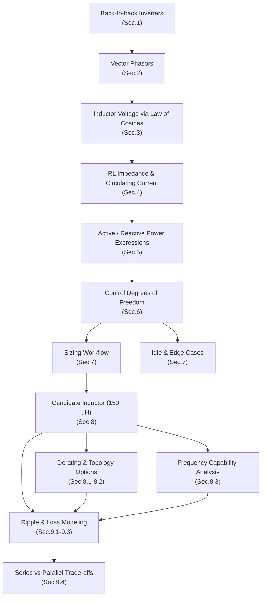
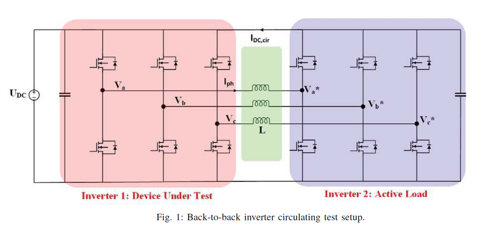
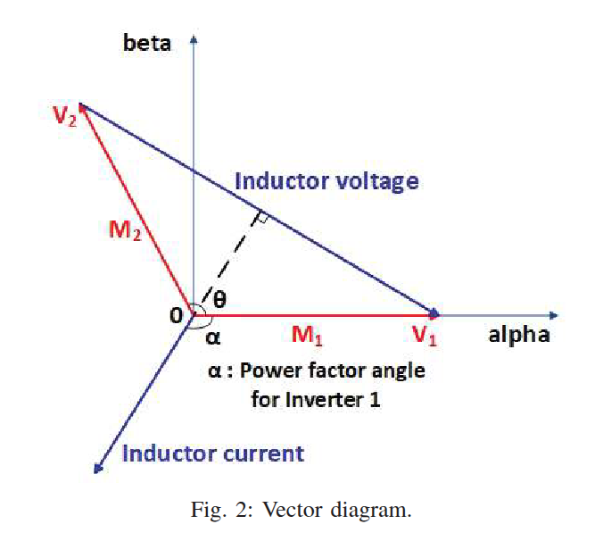
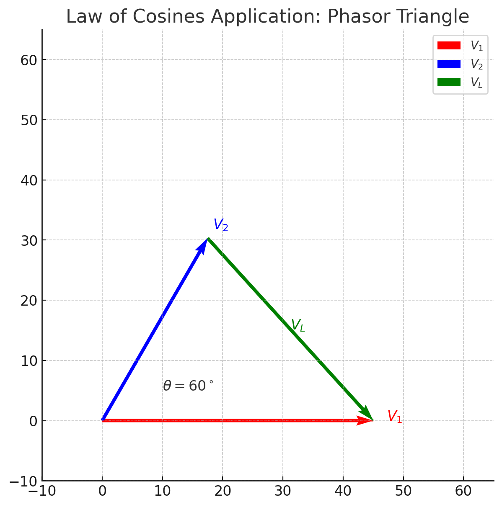
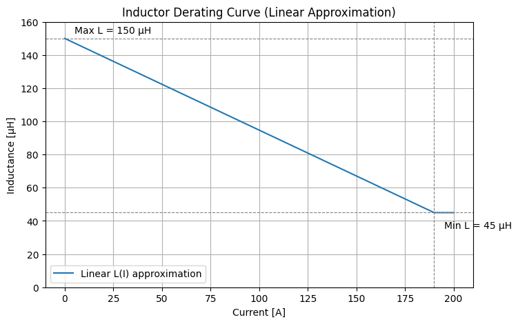
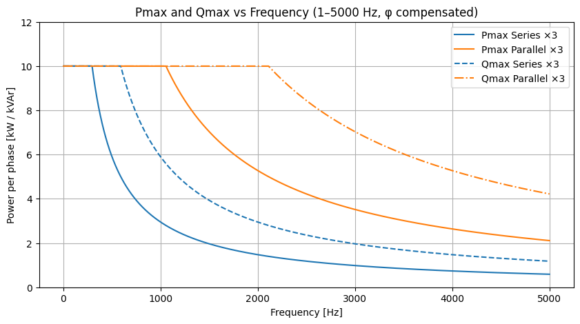
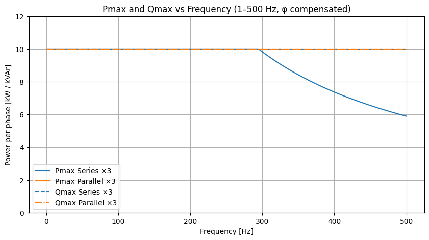

# Opposition Inverter Power Control and Inductor Sizing

---
This document is dedicated to the sizing of the inductors needed for an opposition test bench between two three-phase inverters. 
It is organized according to the structure below.

## Overview of this document

---

## 1. Testbench Setup

The opposition method is implemented using **two back-to-back inverters** sharing a common DC bus and exchanging power through a coupling inductor:

- **Inverter 1**: Device under test  
- **Inverter 2**: Active load  
- **Inductor $L$**: Enforces circulating current dynamics  

---

## 2. Vector Diagram Basis

Each inverter generates a voltage phasor; their difference defines the inductor voltage and circulating current.

- $M_1, M_2$: modulation indices of inverters  
- $	heta$: phase shift angle between them  
- $V_1, V_2$: phasor voltages of the two inverters  
- $V_L$: differential voltage applied to the inductor  
- $I$: circulating current  

---

## 3. Inductor Voltage

The inductor is connected between the outputs of the two inverters.  
Each inverter generates a **phasor voltage** relative to the DC bus midpoint:

- Inverter 1:  
>$$
>V_1 = \frac{M_1 U_{DC}}{2}
>$$

- Inverter 2:  
>$$
>V_2 = \frac{M_2 U_{DC}}{2}
>$$

where $M_1$ and $M_2$ are the modulation indices (ranging from 0 to 1).

### Phasor Difference

The **inductor voltage** is the vector difference of these two phasors:

$$
\vec{V}_L = \vec{V}_1 - \vec{V}_2
$$

Since $\vec{V}_1$ and $\vec{V}_2$ are not necessarily aligned, their angle separation is $\theta$ (the phase shift imposed between the two inverters).

Thus, the magnitude of the inductor voltage is:

$$
V_L = |\vec{V}_1 - \vec{V}_2|
$$

### Law of Cosines Application

From the vector diagram, we form a triangle with sides:

- $a = V_1 = \tfrac{M_1 U_{DC}}{2}$  
- $b = V_2 = \tfrac{M_2 U_{DC}}{2}$  
- $c = V_L$ (side opposite to angle $\theta$)

By the **law of cosines**:

$$
V_L^2 = V_1^2 + V_2^2 - 2 V_1 V_2 \cos\theta
$$

Substituting $V_1$ and $V_2$:

>$$
>V_L = \frac{U_{DC}}{2} \sqrt{M_1^2 + M_2^2 - 2 M_1 M_2 \cos\theta}
>$$

---
## 4. Current Through RL Impedance

Once the inductor voltage $V_L$ is established (from the vector difference of $V_1$ and $V_2$), the circulating current depends on the inductor’s impedance.

### Impedance Model

The inductor is not ideal: it has both an inductance $L$ and a winding resistance $R_L$.  
Its complex impedance is:

$$
Z = R_L + j \omega L
$$

Magnitude and angle:

$$
|Z| = \sqrt{R_L^2 + (\omega L)^2}, 
\qquad
\phi = \tan^{-1}\!\Big(\frac{\omega L}{R_L}\Big)
$$

where:
- $\omega = 2 \pi f$ is the angular frequency of the circulating current,  
- $\phi$ is the phase lag of the current relative to the applied inductor voltage $V_L$.

### Current Magnitude

By Ohm’s law in phasor form:

$$
I = \frac{V_L}{|Z|}
$$

This defines the amplitude of the circulating current for a given $V_L$, $L$, and $R_L$.

### Limiting Cases

- **Purely resistive inductor ($L \to 0$):**  
  $$ Z \approx R_L, \quad \phi \approx 0^\circ $$  
  Current is in phase with voltage → **only active power** is exchanged.  

- **Ideal inductor ($R_L \to 0$):**  
  $$ Z \approx j \omega L, \quad \phi \approx 90^\circ $$  
  Current lags voltage by 90° → **only reactive power** is exchanged.  

- **Practical inductor:**  
  $$ 0 < \phi < 90^\circ $$  
  Current lags by less than 90°, meaning the inductor exchanges both **active and reactive power**.  
  To achieve a *purely reactive test*, the controller must **offset $\theta$ by $\phi$**.

## 5. Active and Reactive Power

From the previous sections:

- Inverter phasors:
$$
V_1 = \frac{M_1 U_{DC}}{2}, 
\qquad 
V_2 = \frac{M_2 U_{DC}}{2}
$$

- Inductor voltage (law of cosines):
$$
V_L = \frac{U_{DC}}{2} \sqrt{M_1^2 + M_2^2 - 2 M_1 M_2 \cos\theta}
$$

- Impedance magnitude and phase:
$$
|Z| = \sqrt{R_L^2 + (\omega L)^2}, 
\qquad 
\phi = \tan^{-1}\!\Big(\frac{\omega L}{R_L}\Big)
$$

### Circulating Current

Thus the magnitude of the inductor current is:

$$
I = \frac{V_L}{|Z|} 
= \frac{\tfrac{U_{DC}}{2} \sqrt{M_1^2 + M_2^2 - 2 M_1 M_2 \cos\theta}}
{\sqrt{R_L^2 + (\omega L)^2}}
$$

This explicitly ties $I$ to the modulation indices $(M_1, M_2)$, their phase shift $\theta$, and the inductor parameters $(R_L, L)$.

### Active and Reactive Power Expressions

Relative to inverter 1, the current lags by $\phi$. The effective angle between $V_1$ and $I$ is $(\theta - \phi)$. Therefore:

- **Active power:**
$$
P = V_1 I \cos(\theta - \phi)
= \frac{M_1 U_{DC}}{2} 
\cdot 
\frac{\tfrac{U_{DC}}{2} \sqrt{M_1^2 + M_2^2 - 2 M_1 M_2 \cos\theta}}
{\sqrt{R_L^2 + (\omega L)^2}} 
\cos(\theta - \phi)
$$

- **Reactive power:**
$$
Q = V_1 I \sin(\theta - \phi)
= \frac{M_1 U_{DC}}{2} 
\cdot 
\frac{\tfrac{U_{DC}}{2} \sqrt{M_1^2 + M_2^2 - 2 M_1 M_2 \cos\theta}}
{\sqrt{R_L^2 + (\omega L)^2}} 
\sin(\theta - \phi)
$$

- **Apparent power:**
$$
S = V_1 I = \sqrt{P^2 + Q^2}
$$

---

## 6. Power Control Degrees of Freedom

We now see clearly how each parameter plays a role:

| Parameter | Role Description |
|--- |--- |
|  **$M_1, M_2$** | Define the voltage phasors, hence $V_L$, hence the **magnitude of current $I$**.  |
|  **$\theta$ (phase shift)** | Determines the orientation of $V_1$ and $V_2$, shaping the vector difference and shifting the effective power factor angle $(\theta - \phi)$.  |
|  **$\phi$ (load angle)** | Comes from the inductor’s RL ratio. It slightly offsets the desired control angle and must be compensated if pure reactive transfer is required.  |

    

>**Together, $(M_1, M_2, \theta)$ give independent control of active power $P$ and reactive power $Q$, within the limits > imposed by $R_L$, $L$, and current saturation.**

---

## 7. Ideal Sizing Logic (No Derating, Two-Step View)

In the simple sizing logic, $R_L$ and $L$ are treated as if they could be **independently chosen**:  
- One edge case defines $R_L$ for **active transfer**  
- Another edge case defines $L$ for **reactive transfer**  

In real components, both $R_L$ and $L$ coexist, so the correct approach is a **two-step sizing + verification**.

### Step A — Active-edge sizing (treat $L \to 0$)

Phasors aligned ($\theta = 0,\; M_1=1,\; M_2=0$), so $V_L = U_{DC}/2$:

$$
I_{\text{act}} = \frac{U_{DC}/2}{\sqrt{R_L^2+(\omega L)^2}}
$$

Ignoring $L$, the target resistance is:

$$
R_{L,\;target} = \frac{U_{DC}}{2I_{max}}
$$

### Step B — Reactive-edge sizing (treat $R_L \to 0$)

Phasors opposite ($\theta = \pi,\; M_1=M_2=1$), so $V_L = U_{DC}$:

$$
I_{\text{reac}} = \frac{U_{DC}}{\sqrt{R_L^2+(\omega L)^2}}
$$

Ignoring $R_L$, the target inductance is:

$$
L_{target} = \frac{U_{DC}}{\omega I_{max}}
$$

---

### Step C — Combine and Verify

For an inductor with series resistance:

$$
Z = R_L + j \omega L
$$

the phase angle of the current lag is:

$$
\phi = \tan^{-1}\!\Big(\frac{\omega L}{R_L}\Big)
$$

From the impedance triangle:

$$
\cos\phi = \frac{R_L}{\sqrt{R_L^2 + (\omega L)^2}}
\qquad
\sin\phi = \frac{\omega L}{\sqrt{R_L^2 + (\omega L)^2}}
$$

### Theoretical Maximum Active Power

When the controller compensates for $\phi$ (so $\cos(\theta-\phi)=1$), the current is in phase with $V_1$:

$$
I = \frac{U_{DC}/2}{\sqrt{R_L^2+(\omega L)^2}}
$$

Therefore:

$$
P_{\max}^{(\text{act})} 
= V_1 \cdot I
= \frac{U_{DC}}{2} \cdot \frac{U_{DC}/2}{\sqrt{R_L^2+(\omega L)^2}}
= \frac{U_{DC}^2}{4}\,\frac{1}{\sqrt{R_L^2+(\omega L)^2}}
$$

### Theoretical Maximum Reactive Power

When the controller compensates for $\phi$ (so $\sin(\theta-\phi)=1$), the current is 90° out of phase with $V_1$:

$$
I = \frac{U_{DC}}{\sqrt{R_L^2+(\omega L)^2}}
$$

Therefore:

$$
Q_{\max}^{(\text{reac})} 
= V_1 \cdot I
= \frac{U_{DC}}{2} \cdot \frac{U_{DC}}{\sqrt{R_L^2+(\omega L)^2}}
= \frac{U_{DC}^2}{2}\,\frac{1}{\sqrt{R_L^2+(\omega L)^2}}
$$

### Idle Active and Reactive Power (θ = 0)

When the two inverter phasors are **aligned** ($\theta = 0$):

- Inductor voltage:
$$
V_L = \frac{U_{DC}}{2}\,|M_1 - M_2| \;=\; \frac{U_{DC}}{2}\,|\Delta M|,\quad \Delta M \equiv M_1 - M_2
$$

- Inductor impedance and angle:
$$
Z = R_L + j\omega L,\qquad |Z|=\sqrt{R_L^2+(\omega L)^2},\qquad 
\phi=\tan^{-1}\!\Big(\frac{\omega L}{R_L}\Big)
$$

- Circulating current magnitude:
$$
I = \frac{V_L}{|Z|} \;=\; \frac{U_{DC}}{2}\,\frac{|\Delta M|}{\sqrt{R_L^2+(\omega L)^2}}
$$

- Inverter-1 fundamental voltage:
$$
V_1 = \frac{M_1 U_{DC}}{2}
$$

Because $\theta=0$, the angle between $V_1$ and $I$ is $-\phi$. Therefore:

$$
\cos(\theta-\phi)=\cos(-\phi)=\cos\phi=\frac{R_L}{|Z|},\qquad
\sin(\theta-\phi)=\sin(-\phi)=-\sin\phi=-\frac{\omega L}{|Z|}
$$

$$
P_{\text{idle}} \;=\; V_1\,I\,\cos(\theta-\phi)
\;=\; \frac{M_1 U_{DC}}{2}\cdot \frac{U_{DC}}{2}\cdot 
\frac{|\Delta M|}{|Z|}\cdot \frac{R_L}{|Z|}
\;=\; \frac{U_{DC}^2}{4}\; M_1\; |\Delta M|\; \frac{R_L}{R_L^2+(\omega L)^2}
$$

$$
Q_{\text{idle}} \;=\; V_1\,I\,\sin(\theta-\phi)
\;=\; \frac{M_1 U_{DC}}{2}\cdot \frac{U_{DC}}{2}\cdot 
\frac{|\Delta M|}{|Z|}\cdot \Big(-\frac{\omega L}{|Z|}\Big)
\;=\; -\,\frac{U_{DC}^2}{4}\; M_1\; |\Delta M|\; \frac{\omega L}{R_L^2+(\omega L)^2}
$$

---

> The negative sign in $Q_{\text{idle}}$ reflects that, with $\theta=0$, the current **lags** $V_1$ by $\phi$ (inductive). Its **magnitude** is:
$$
|Q_{\text{idle}}| \;=\; \frac{U_{DC}^2}{4}\; M_1\; |\Delta M|\; \frac{\omega L}{R_L^2+(\omega L)^2}
$$

---

#### Special case: perfectly matched modulations
If $M_1=M_2$ (i.e., $\Delta M=0$), then $V_L=0 \Rightarrow I=0$, and

$$
P_{\text{idle}}=Q_{\text{idle}}=0
$$

at the **fundamental**. (Non-idealities like dead-time and PWM ripple can still create HF circulating components, but they do not appear in this fundamental power model.)

### Interpretation

- With **active control compensation**, the resistive and inductive ratios ($\cos\phi$, $\sin\phi$) no longer limit the achievable $P$ and $Q$.  
- The bottleneck becomes the combined magnitude of the impedance, $\sqrt{R_L^2+(\omega L)^2}$.  
- Both $P_{\max}$ and $Q_{\max}$ scale inversely with $|Z|$:  
  - $P_{\max} \propto \tfrac{1}{\sqrt{R_L^2+(\omega L)^2}}$  
  - $Q_{\max} \propto \tfrac{1}{\sqrt{R_L^2+(\omega L)^2}}$  

Thus, by compensating $\phi$, the algorithm restores symmetry between $P$ and $Q$ capability.

## 8. Validating a Candidate Inductor (LCSC 150 µH) — Behavior, Topology, and Frequency Limits

**Datasheet:** [LCSC C37634000 (150 µH)](https://www.lcsc.com/datasheet/C37634000.pdf)

### 8.1 Non-linear inductance (derating)
From the datasheet curve (inductance vs current), we approximate a **linear** current-dependent inductance for a **single core** as shown below. 

$$
L_{\text{single}}(I)\ \approx\ \mathrm{clip}\!\Big(L_0 - k\,I,\ L_{\min},\,L_0\Big),
\quad
L_0\simeq150~\mu\text{H},\ L_{\min}\simeq45~\mu\text{H},
$$
with slope
$$
k \ \approx\ \frac{L_0-L_{\min}}{190~\text{A}}
\ \simeq\ 0.553~\mu\text{H/A}.
$$

> 

---

### 8.2 Series vs Parallel realizations (per phase, using 3 identical parts)

- **Series ×3**
  - Total inductance:
    $$
    L_{\text{tot,ser}}(I)\ =\ 3\,L_{\text{single}}(I)
    $$
  - Per-core current: $I_{\text{core}}=I$

- **Parallel ×3**
  - Total inductance:
    $$
    L_{\text{tot,par}}(I)\ =\ \frac{L_{\text{single}}(I/3)}{3}
    $$
  - Per-core current: $I_{\text{core}}=I/3$

> Intuition: 
> **Series** increases $L_{\text{tot}}$ but each core sees full current (earlier saturation).  
> **Parallel** reduces $L_{\text{tot}}$ but each core sees only $I/3$ (stays in higher-L region at high current).

---

### 8.3 Frequency-dependent capability (1–500 Hz)

We look at **opposition test edges** with control **compensating** the RL angle $\phi$ (so $\cos(\theta\!-\!\phi)=1$ for $P_{\max}$ and $\sin(\theta\!-\!\phi)=1$ for $Q_{\max}$).

Let $U_{DC}$ be the DC link, $I_{\max}$ the peak phase current limit, and $V_1=U_{DC}/2$.

- **Reactive edge (θ ≈ φ + 90°, M₁=M₂=1):** the inductor sees $V_L=U_{DC}$.
- **Active edge (θ ≈ φ, M₁=1, M₂=0):** the inductor sees $V_L=U_{DC}/2$.

Because $L$ depends on **current**, the exact current must be found implicitly:
$$
I \;=\; \frac{V_L}{2\pi f\,L_{\text{tot}}(I)}.
$$
For quick validation we use a **conservative single-pass** evaluation by plugging the worst-case inductance at the current limit:

- Choose the topology (**series** or **parallel**), compute
  $$
  L_{\text{tot}}^{\ast} \;=\; 
  \begin{cases}
  3\,L_{\text{single}}(I_{\max}) & \text{(series)}\\[2mm]
  \dfrac{L_{\text{single}}(I_{\max}/3)}{3} & \text{(parallel)}
  \end{cases}
  $$
- Then the **inductor-limited** (no $I_{\max}$ clipping) currents are
  $$
  I_{\text{reac}}^{L}(f)\ =\ \frac{U_{DC}}{2\pi f\,L_{\text{tot}}^{\ast}}, 
  \qquad
  I_{\text{act}}^{L}(f)\ =\ \frac{U_{DC}/2}{2\pi f\,L_{\text{tot}}^{\ast}}.
  $$
- Apply the **current limit**
  $$
  I_{\text{reac}}(f) \;=\; \min\!\big(I_{\max},\ I_{\text{reac}}^{L}(f)\big), 
  \qquad
  I_{\text{act}}(f)  \;=\; \min\!\big(I_{\max},\ I_{\text{act}}^{L}(f)\big).
  $$

With $\phi$ compensated, the **per-phase** maximum powers (1–500 Hz) are
$$
P_{\max}(f) \;=\; V_1\, I_{\text{act}}(f) \;=\; \frac{U_{DC}}{2}\, I_{\text{act}}(f),
\qquad
Q_{\max}(f) \;=\; V_1\, I_{\text{reac}}(f) \;=\; \frac{U_{DC}}{2}\, I_{\text{reac}}(f).
$$

> **Results between (1–5000 Hz):**  
>   
> **Zoom on the results between (1–500 Hz):**  
>   

### 8.4 Notes on accuracy and refinement

- The **single-pass** method uses $L_{\text{tot}}^{\ast}$ at $I_{\max}$ to avoid solving the implicit equation; it is **conservative** at low $f$ and near $I_{\max}$.  
- For tighter results, iterate:
  1) assume $I$, 
  2) evaluate $L_{\text{single}}(I_{\text{core}})$,  
  3) build $L_{\text{tot}}$, 
  4) update $I = V_L /(2\pi f L_{\text{tot}})$, repeat until convergence, 
  5) clamp to $I_{\max}$.  
- If you need **RMS loss** predictions, add $R_L$ and switching-ripple to compute copper/core losses as in the switching section.

### 8.5 Quick crossover estimates

From the power expressions, both **active** and **reactive** power scale with the available current magnitude:

$$
I(f) = \min\!\Big(I_{max}, \; \frac{U_{DC}}{2\pi f L_{\text{tot}}^\ast} \Big)
$$

Since $P_{\max}$ and $Q_{\max}$ differ only by their trigonometric factor (cosine or sine), and we assume **$\phi$ compensation in control**, their current limitation occurs at the same frequency.  
Thus the crossover frequencies for $P$ and $Q$ are **identical**:

$$
f_{\times} = \frac{U_{DC}}{2\pi \, L_{\text{tot}}^\ast \, I_{max}}
$$

- **Series ×3**: $L_{\text{tot}}^\ast = 3 L(I)$ → higher inductance, lower $f_{\times}$, earlier roll-off.  
- **Parallel ×3**: $L_{\text{tot}}^\ast = L(I/3)/3$ → smaller inductance, higher $f_{\times}$, better high-frequency bandwidth.  

This explains why in the plot both $P_{\max}$ and $Q_{\max}$ track together, and why the **parallel configuration maintains full power capability up to higher frequencies**.

---

## 9. Switching Frequency and Losses

When applying PWM at a switching frequency $f_{sw}$, the inductor current is not purely sinusoidal.  
It includes a **high-frequency ripple** on top of the fundamental current.  
This ripple depends on the DC link voltage, the inductance, and the switching frequency.

### 9.1 Ripple Current

For a half-bridge leg applying a PWM duty cycle, the **worst-case voltage across the inductor** is approximately:

$$
V_{L,\text{pp}} \approx \frac{U_{DC}}{2}
$$

During each switching period $T_{sw} = 1/f_{sw}$, the inductor current slope is:

$$
\frac{di}{dt} = \frac{V}{L_{tot}}
$$

So the **peak-to-peak ripple** is:

$$
\Delta I_{pp} \approx \frac{V_{DC}}{2 \, L_{tot} f_{sw}}
$$

Converting to an RMS value for a triangular waveform:

$$
I_{\text{ripple,rms}} = \frac{\Delta I_{pp}}{2\sqrt{3}}
$$

### 9.2 Copper Losses

The winding resistance of all inductors adds to:

$$
R_{tot}
$$

The RMS current flowing through this resistance causes **ohmic heating**:

$$
P_{cu} = R_{tot} \, I_{\text{rms}}^2
$$

Here, $I_{\text{rms}}$ includes both the **fundamental sinusoidal current** and the **HF ripple contribution**.  
Thus copper losses increase with current magnitude, regardless of frequency.

### 9.3 Core-loss model (α, β) for the proposed inductor

**Part:** Ruishen RSCH182110-150µH (LCSC C37634000) — 150 µH, up to ≈200 A.  
**Datasheet:** [C37634000 PDF](https://www.lcsc.com/datasheet/C37634000.pdf)

#### Why α and β matter

When PWM is applied, the inductor flux swings every switching cycle, creating **core loss**.  
The **Generalized Steinmetz Equation (GSE)** is commonly used:

$$
P_{\text{core}} \;=\; k \, f_{sw}^{\alpha}\, (\Delta B)^{\beta}\, V_{\text{core}}
$$

- $f_{sw}$ = switching frequency  
- $\Delta B$ = flux swing per cycle  
- $V_{\text{core}}$ = magnetic volume  
- $k,\alpha,\beta$ = empirical constants of the core material  

#### Relating ΔB to current ripple

Flux linkage is related to inductance:

$$
\lambda = L i = N \Phi = N B A_e
$$

so the flux swing is

$$
\Delta B = \frac{\Delta \lambda}{N A_e} = \frac{L_{\text{tot}} \, \Delta I}{N A_e}
$$

Since geometry parameters ($N, A_e, V_{\text{core}}$) are not provided for this shielded inductor, they are folded into an effective constant $k'$.  
Thus we can write a **practical form**:

$$
P_{\text{core}} \;\approx\; k' \, f_{sw}^{\alpha} \, \Bigg(\frac{\Delta I}{L_{\text{tot}}}\Bigg)^{\beta}
$$

#### Typical α, β values

The datasheet does **not** publish Steinmetz parameters. For ferrite-like materials, typical ballpark exponents are:

$$
\alpha \;\approx\; 1.3 \;\text{to}\; 1.7, \qquad 
\beta \;\approx\; 2.3 \;\text{to}\; 2.8
$$

A good starting point for this inductor is:

$$
\alpha = 1.5, \quad \beta = 2.6
$$

Calibration of $k'$ should be done experimentally (measure temperature rise at representative $f_{sw}$ and ripple).

#### Ripple current as the driver

PWM ripple for opposition setup:

$$
\Delta I_{pp} \approx \frac{U_{DC}}{2\,L_{\text{tot}}\, f_{sw}}, 
\qquad 
I_{\text{ripple,rms}} \approx \frac{\Delta I_{pp}}{2\sqrt{3}}
$$

Therefore the core-loss scaling becomes:

$$
P_{\text{core}} \propto f_{sw}^{\alpha} 
\left(\frac{U_{DC}}{L_{\text{tot}}^2 f_{sw}}\right)^{\beta}
$$

Simplifying trends (with typical exponents):

- Higher $L_{\text{tot}}$ → much lower core loss ($\sim L_{\text{tot}}^{-2\beta}$)  
- Higher $f_{sw}$ → mixed effect:  
  - Ripple shrinks as $1/f_{sw}$  
  - Steinmetz increases as $f_{sw}^\alpha$  
  - Net exponent $\alpha-\beta \approx -1.1$ → higher $f_{sw}$ actually **reduces core loss** in this model  

#### Series vs Parallel (including α, β effects)

- **Series ×3**
  - $L_{\text{tot}} = 3 L(I)$, each core sees full current  
  - Larger $L_{\text{tot}}$ → smaller ripple → **lower core losses**  
  - Higher copper loss since each winding carries full current  

- **Parallel ×3**
  - $L_{\text{tot}} = L(I/3)/3$, each core sees only $I/3$  
  - Smaller $L_{\text{tot}}$ → larger ripple → **higher core losses**  
  - Lower copper loss and better saturation margin  

**Practical note:**  
For the C37634000 inductor, use the datasheet L(I) curve to compute effective $L_{\text{tot}}$ at your operating current.  
Then evaluate $P_{\text{core}}$ with assumed $\alpha,\beta$ and adjust constant $k'$ by thermal test at your switching frequency.

### 9.4 Trade-offs

- **Series ×3**
  - Higher $L_{tot}$ → lower ripple, lower core losses.
  - But each winding carries full current → higher copper losses.

- **Parallel ×3**
  - Lower $L_{tot}$ → larger ripple, higher core losses.
  - Current is shared among windings → lower copper losses, better saturation headroom.

This balance between **ripple**, **copper heating**, and **core heating** defines the **optimal switching frequency** and **configuration** for a given power test.

---
